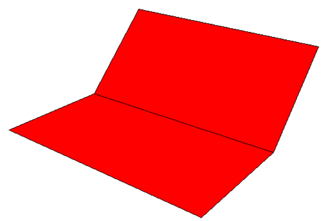
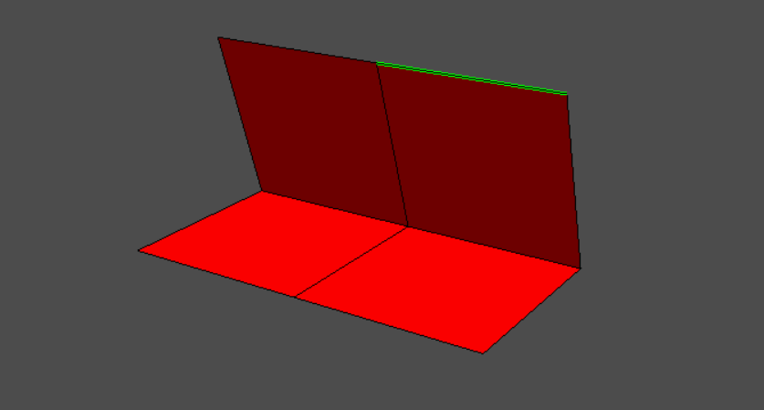
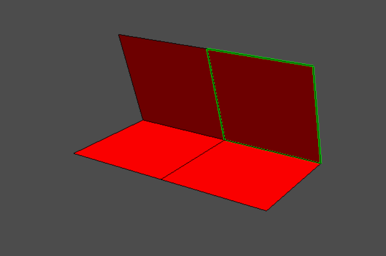
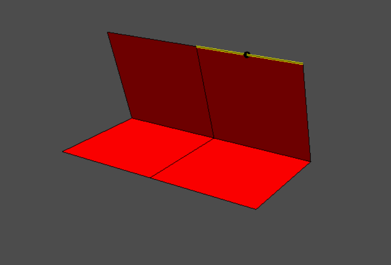
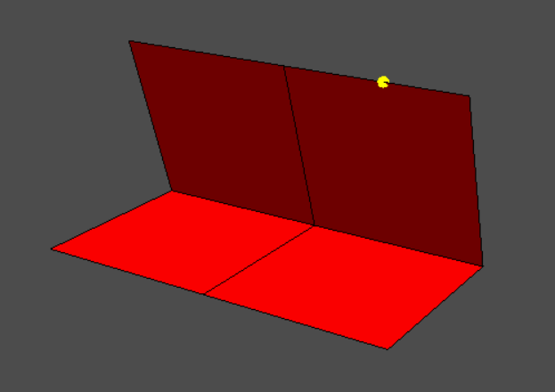
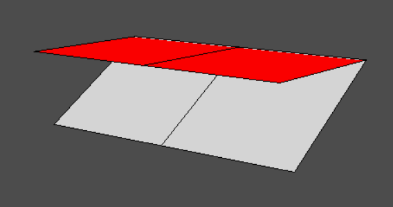
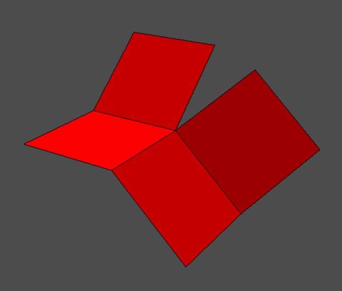

# Origami Simulation Project
This project was an attempt to simulate origami folding in 3D, combining rendering, geometry, and physics. My goal was to create a system where users could freely fold paper, with realistic behavior emerging from the software.

### Early Prototype: Tkinter Rendering
The project began with a simple 3D rendering engine written in Tkinter. A camera was defined by position and facing vector, and each paper point was projected into 2D screen space using perspective. Points behind the camera were ignored, and polygons were drawn with depth-ordering to approximate hidden surfaces.
This prototype allowed basic folds by rotating faces, and I also implemented a movable camera. It was limited but proved that the concept was possible.

   
  <i>Early Tkinter prototype showing a basic paper model with a simple fold. This version used manual trigonometry for rotation rather than matrix transformations.</i>

### Transition to OpenGL
Tkinter quickly became hard to debug, so I moved to OpenGL with Pygame for the window and PyGLM for vector and matrix math. Following tutorials, I learned about model and projection matrices and built a paper model starting from a simple face. This transition gave me exposure to the real rendering pipeline used in games and 3D software.

### Data Structures and User Interaction
I introduced a Face class. Faces are the different segments of the paper, separated by creases. The class stored the face’s points, vertices, and transformation matrix. I also built interaction features:
- Line selection via 2D cursor proximity.

   
  <i>Line selection via cursor proximity</i>

- Face selection via ray casting and Möller–Trumbore intersection.

   
  <i>Face selection using ray casting + Möller–Trumbore intersection</i>

- Point placement along lines for defining creases.

   
  <i>Hovering while creating vertex</i>

   
  <i>After creating the vertex</i>

### Folding Logic and Challenges
Folding was implemented by aligning a crease with an axis, rotating around it, and reversing the transformations. OpenGL matrices made this process more streamlined than my earlier trigonometry-based approach.
The major challenge was keeping connected faces aligned. Folding a single face worked, but multiple folds caused disconnections that looked like the paper was tearing. I tried a parent–child system, where child faces realigned with their parent edge, but this only worked in simple cases and broke down for chains of faces.

### Rendering and Bugs
I added shading with colored faces (red front, white back) and a sunlight vector for contrast. This improved clarity but introduced bugs like faces flipping color unexpectedly, which I resolved after debugging small issues.

   
  <i>A folded paper model, showing red (top) and white (bottom) faces with shading applied. The lighting system darkens faces oriented away from the light source.</i>

I also ran into minor issues with interactions, such as faces rotating around the wrong axes, faces rotating in the wrong direction, and many components generally not being where they should be.

### Constraint Solving and Limitations
The project stalled at the point of needing a true constraint system to maintain connectivity between all faces during folds. My parent–child system was a partial solution, but I lacked the mathematical tools to implement a general solver. This became the main limitation of the project.

   
  <i>Attempt at multi-face folding. While the first constraint is solved (shared edge aligns), subsequent faces disconnect, creating the appearance of a ripped paper.</i>

### Key Takeaways
Despite not completing the physics, the project was a success in terms of learning:
- I moved from a hand-coded projection engine to an OpenGL pipeline.
- I gained hands-on experience with model transformations and matrix math.
- I developed insight into how constraint solving is critical in physics-based simulations.

The most difficult aspects were crease splitting (defining geometry consistently) and constraint solving (keeping folds connected). In the future, with more advanced knowledge of physics and math, I plan to revisit this project and finish what I started.

### Demo Video

https://github.com/user-attachments/assets/bea7709a-307a-4b5e-8093-d013bdda1b02
